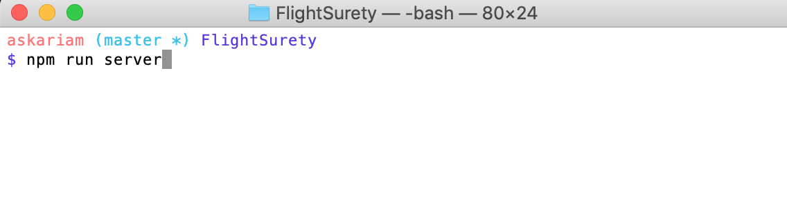
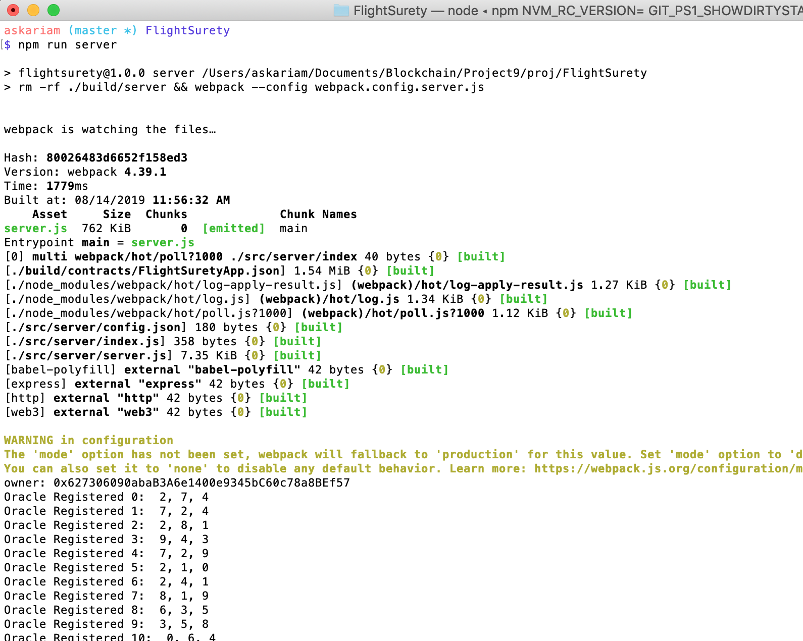
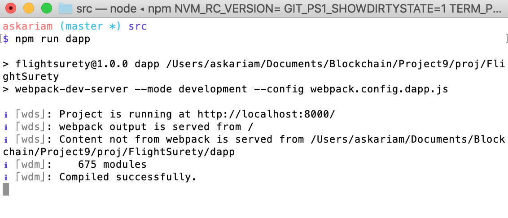
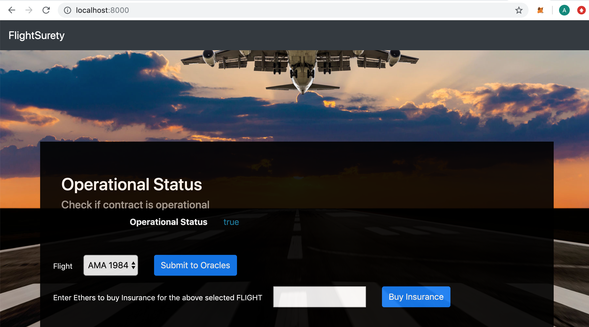

# Project 7 (9): FlightSurety Project

This project is developoed as part of Udacity Blockchain Developer Nanodegree Program. In this project, I implemented FlightSurety DApp that allows passengers to buy insurance for specific flights from airlines operating these flights. This project used the separation of concerns to allow upgradability and maintainance.


## Setup Project for Review

To setup the project for review.
1. Download/Clone the Project.
2. Install ganache-cli if not installed.
3. Install Truffle if not installed.
4. Install all dependencies (npm packages).
```
npm install
```
5. Start ganache with 70 test accounts.
```
ganache-cli -a 70 -m "candy maple cake sugar pudding cream honey rich smooth crumble sweet treat"
```
6. Make note of the differnt accounts and private keys.
7. Compile the smart contracts in another terminal window. For the compilation to work I configured compilers object in truffle.js file.

```
truffle compile
```
```
compilers : {
    solc: {
      version: "^0.4.25"
    }
  }
```
8. After compilation completes, migrate/deploy the smart contracts locally:

```
truffle migrate
```

9. Test the smart contracts:

```
truffle test
```

10. Make sure the 29 tests should pass.


## Testing the DApp in the browser - Run the DApp(Client) and Server

### Start the Server

1. In another terminal window, run the command:
```
npm run server
```
2. The server should run and register the defined number of oracles (in my case 60 oracles)

3. The server should show similar results as below:




### Start the DApp (client)

1. In another terminal window, run the command:
```
npm run dapp
```
2. The DApp should be running on :
[localhost:8000](http://localhost:8000).

3. DApp Should look like below:




4. The DApp allows the user to buy insurance for the selected flight and to fetch the status of the selected flight


## Versions

* Truffle v5.0.19 (core: 5.0.19)
* Node v10.15.3
* Web3 v1.0.0-beta.37
* Solidity v0.4.24 (solc-js)
* Ganache CLI v6.4.3 (ganache-core: 2.5.5)
